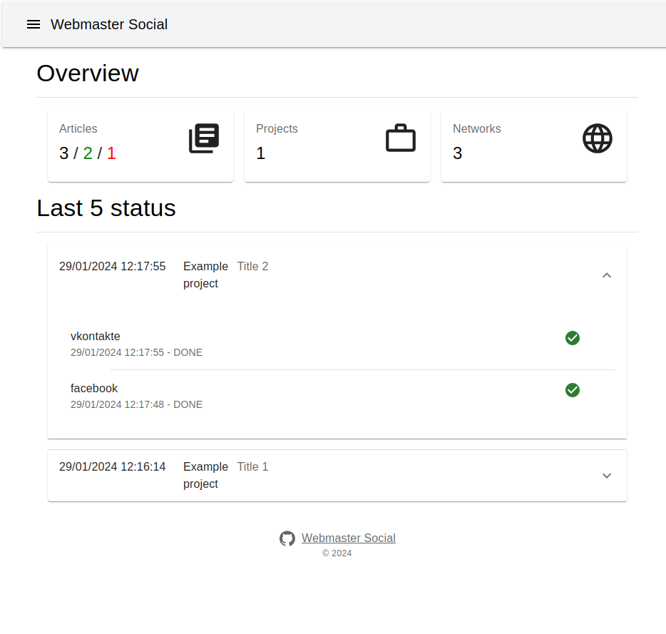
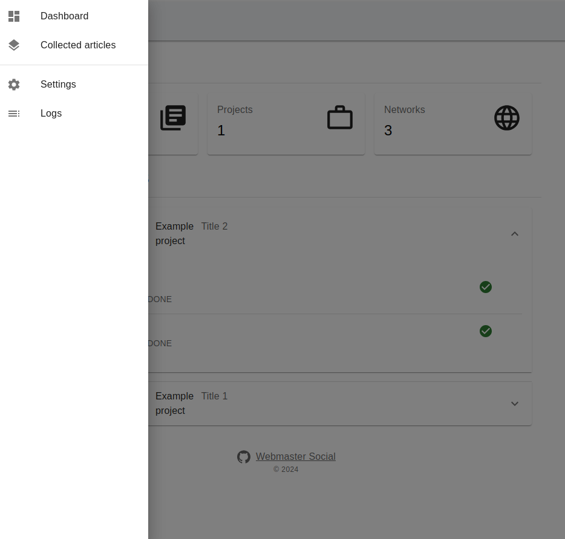
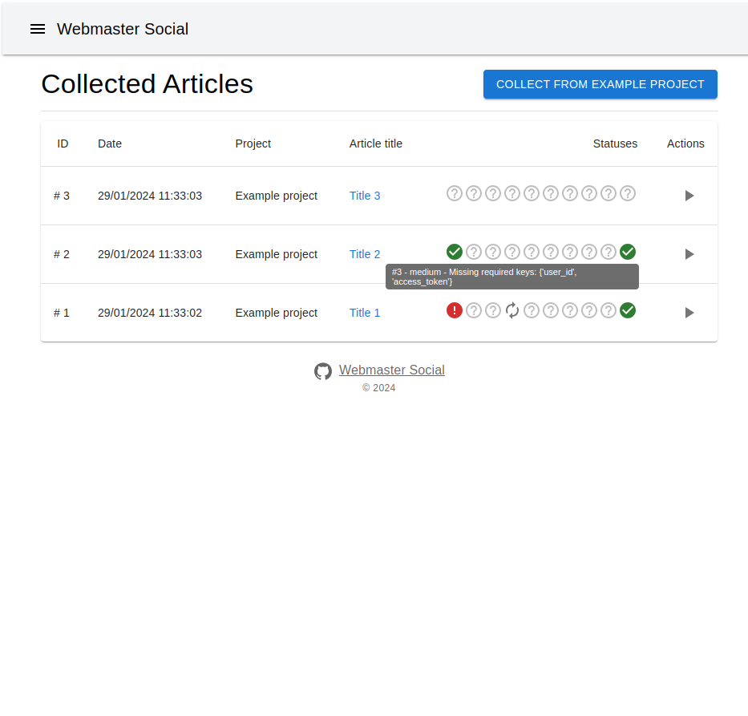
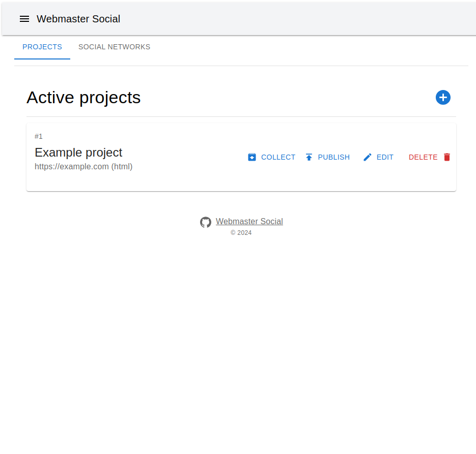
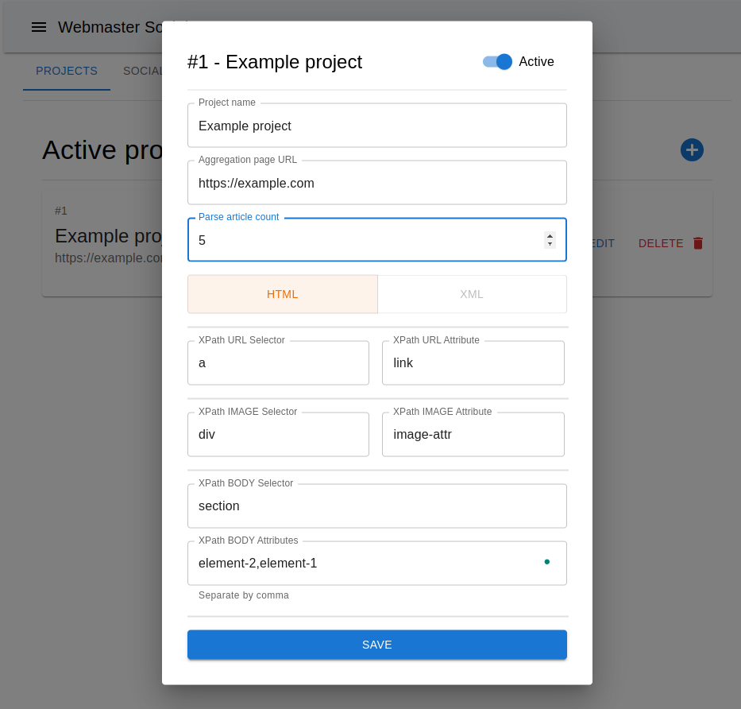
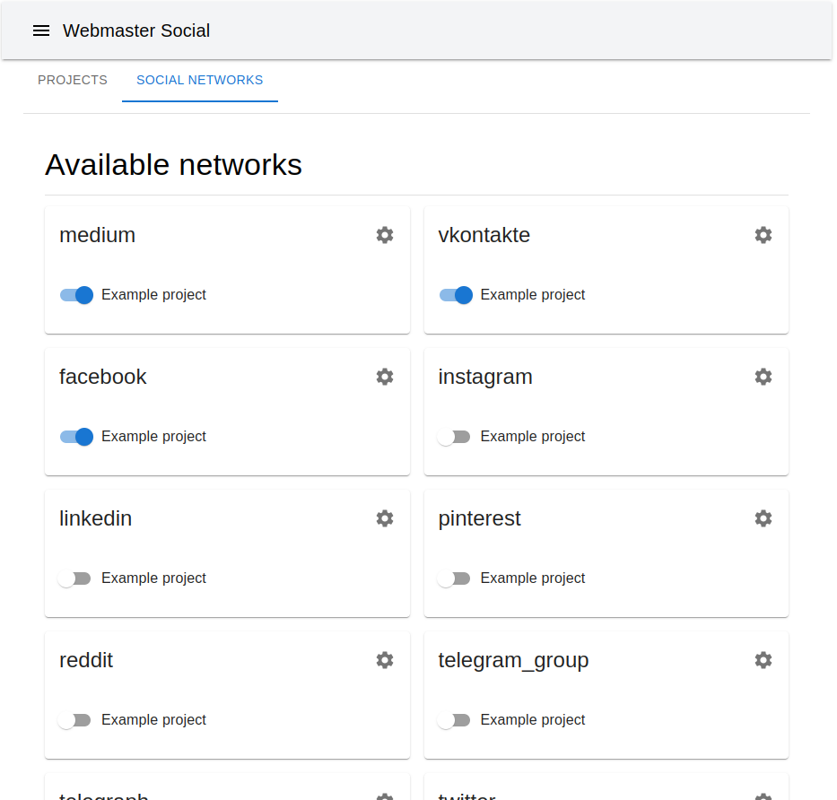
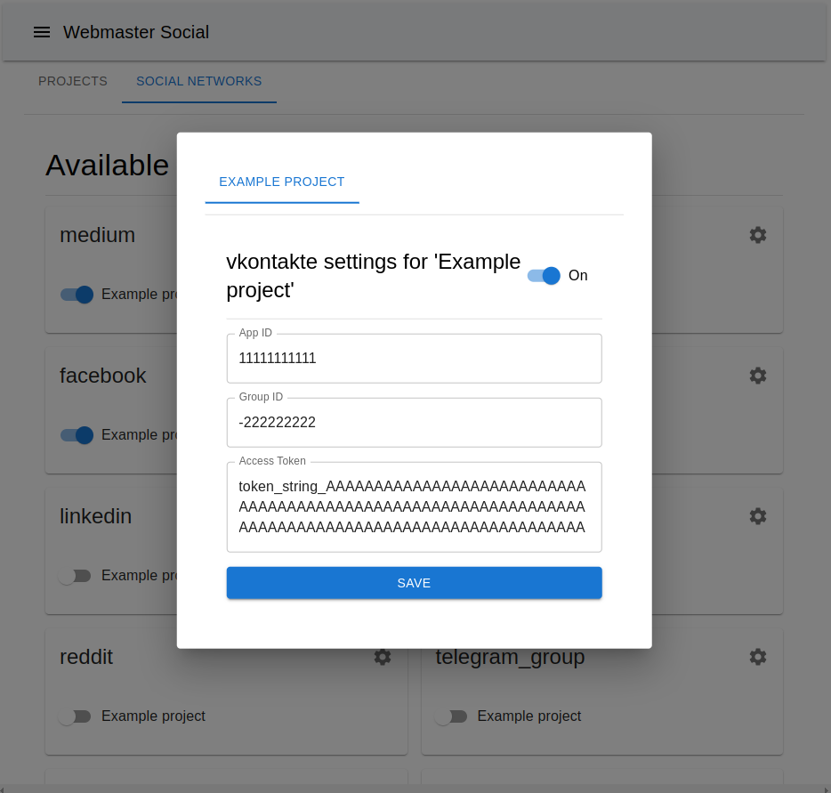
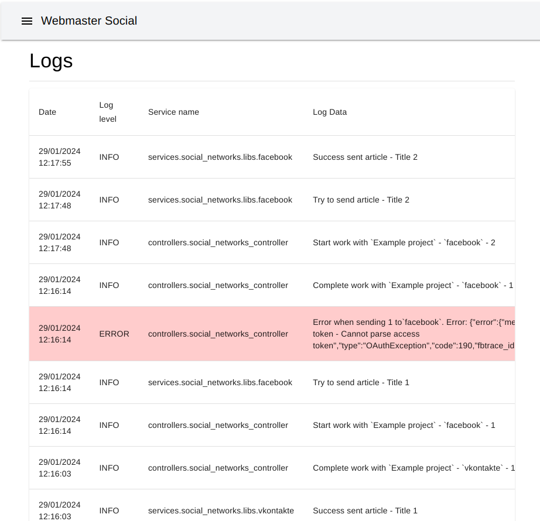

<p align="center">
    
</p>

<hr />

<p align="center">
	<a href="https://github.com/alexmudrak/webmaster-social/actions/workflows/ci-all.yaml" target="_blank">
    
	</a>
</p>

<hr />

## Webmaster Social

The system is a web application comprising a backend built with FastAPI and
PostgreSQL for data storage, and a frontend developed with Next.js using
TypeScript. It enables users to add projects for parsing HTML pages,
collecting published articles, and automatically distributing the gathered
content across various social networks including Facebook, Instagram,
LinkedIn, Medium, Pinterest, Reddit, Telegram Group, Telegraph, Twitter, and
VKontakte. The system integrates with the social networks' APIs to facilitate
content publishing and tracking.

## Features

Brief statistics on the latest system activities and general indicators of the
data added.

<p align="center">
    
</p>

Fast and convenient navigation.

<p align="center">
    
</p>

<details><summary>Screenshots</summary>

A page for displaying all collected materials of projects and the publication
status on social networks.

<p align="center">
    
</p>

Project settings page with buttons to initiate tasks for collecting materials
and posting to social networks.

<p align="center">
    
</p>

Project editing modal window.

<p align="center">
    
</p>

Page displaying all available modules for publishing to social networks.

<p align="center">
    
</p>

Social network settings window for each project.

<p align="center">
    
</p>

Logs page.

<p align="center">
    
</p>
</details>

## Tools Requirement

- git
- docker
- docker-compose

## How to run

- Obtain the latest project code: `git clone <REPO_URL>`
- Navigate to the downloaded directory
- Copy the environment variable file: `cp .env.example .env`

Edit the `.env` file. You need to come up with and record the main settings:

_MANDATORY_

```markdown
PYTHONPATH=backend
LOG_LEVEL=DEBUG
API_URL=                # Public API URL
LOCAL_API_URL=          # Local API URL
SSR_CACHE=              # Method for SSR chache

# DATABASE
DB_HOST=                # Database host
DB_PORT=                # Database port
DB_NAME=                # Database name
DB_USER=                # Database user
DB_PASSWORD=            # Database password

TEST_DB_HOST=           # Test Database host
TEST_DB_PORT=           # Test Database port
TEST_DB_NAME=           # Test Database name
TEST_DB_USER=           # Test Database user
TEST_DB_PASSWORD=       # Test Database password

# TELEGRAM
TELEGRAM_BOT_TOKEN=     # Telegram bot token
TELEGRAM_ADMIN_ID=      # Telegram bot user admin id
```

After setting the mandatory parameters, run:

- `docker-compose up -d --build`

Once all containers are ready, go to:

- `http://localhost:3000/`

## Tech stack

| Backend               | Frontend       |
| --------------------- | -------------- |
| FastAPI               | NextJS / React |
| PostgreSQL            | Material UI    |
| SqlModel / SqlAlchemy |                |
| Alembic               |                |

Enjoy ;)
